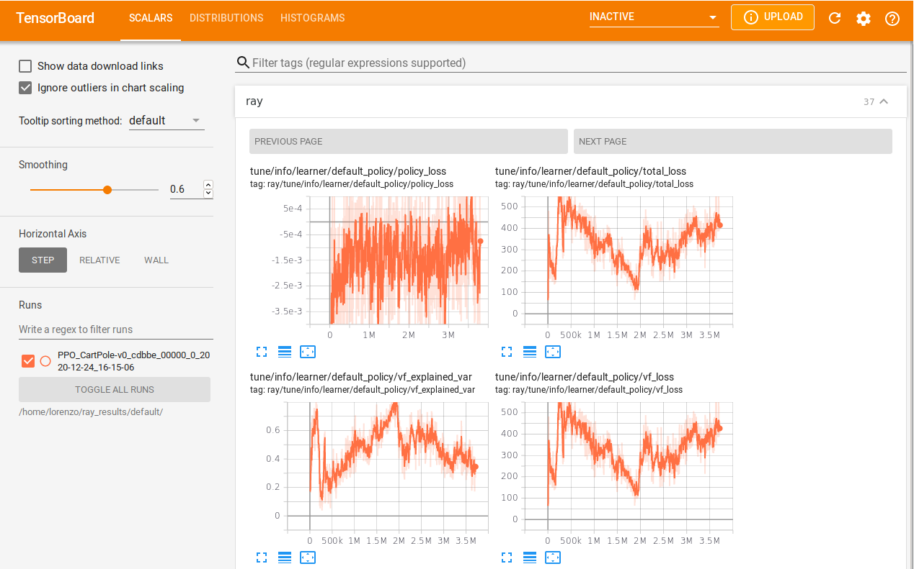

# rlib_test
Testing Rlib and Ray for Reinforcement Learning

## Run
Launch testcase with `launch.sh`

## Visualize
Check Ray Dashboard on webbrowser\
Check results with Tensorboard: `tensorboard --logdir=$HOME/ray_results/default/`

Example (page 2):


Check output:
```
rllib rollout ~/ray_results/default/DQN_CartPole-v0_f8299_00000_0_2020-12-24_17-06-23/checkpoint_110/checkpoint-110 --run DQN --env CartPole-v0 --steps 10000
```
